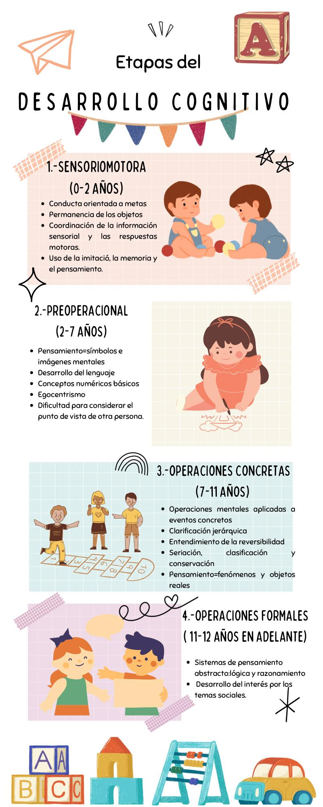

# 1.2 Desarrollo Humano: Sus etapas

## Desarrollo Cognitivo

## Reflexión

La realización de esta actividad y presentación de los demás equipos nos enseño como es que el ser humano se desarrolla, desde el momento que nace el bebe hasta su vida adulta. Como es que el humano adquiere conocimientos desde el momento que nace a través del aprendizaje y la experiencia, y como es que afecta el mal desarrollo del lenguaje al aprendizaje del infante. A medida que el humano se va desarrollando sus pensamientos empiezan a cambiar ademas el tipo de aprendizaje que puede adquirir es diferente, más complejo, teniendo mas en cuenta los riegos de sus actos y queriendo aprender mas de si mismo y el mundo que lo rodea. Para la adolescencia este quiere tener mas libertad hasta el punto de independizarse y hacer su vida por su cuenta hasta la adultez, desarrollándose mas en el trabajo. Llegando a la vejez algunos pueden llegar a ser muy activos, mucho dependiendo de su estilo y ritmo de vida, pero otros llegan a ser unas cargas para unos, ya que en general se pierden muchas habilidades físicas y se llegan a manifestar algunas enfermedades crónicas, llegando hasta el fin de la vida.
