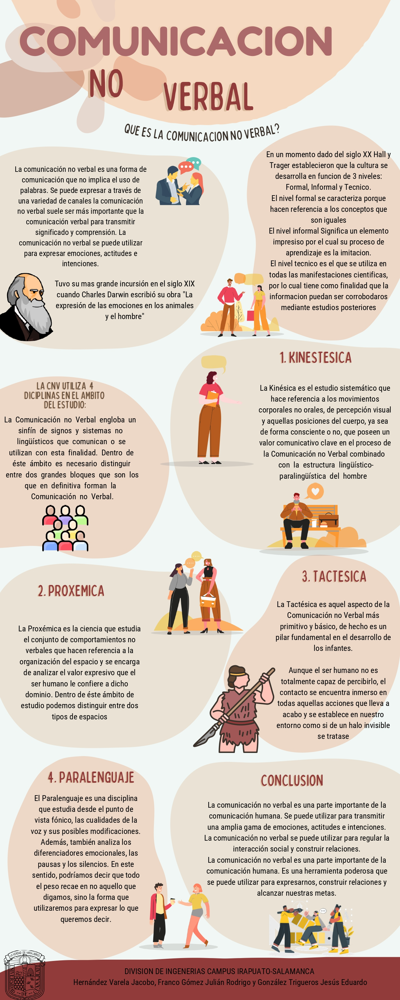

# 3.2 Comunicación no verbal

## Reflexión

La realización de esta actividad y presentación de los demás equipos nos enseña la importancia de la comunicación no verbal como parte fundamental de la comunicación humana. Desde el momento en que nacemos, comenzamos a adquirir conocimientos a través del aprendizaje y la experiencia, y a medida que nos desarrollamos, nuestros pensamientos y formas de aprendizaje cambian. Aquí este tipo de comunicación es donde toma un papel importante, ya que puede mejorar las capacidad de una persona para relacionarse, participar y establecer interacciones significativas en la vida cotidiana. Esta forma de comunicación ncluye gestos, posturas, contacto físico y tono de voz, y complementa el mensaje verbal.

En resumen, la comunicación no verbal es una parte fundamental de nuestra vida y desarrollo. Nos ayuda a transmitir y recibir información de manera efectiva, a establecer relaciones saludables y significativas con los demás.
